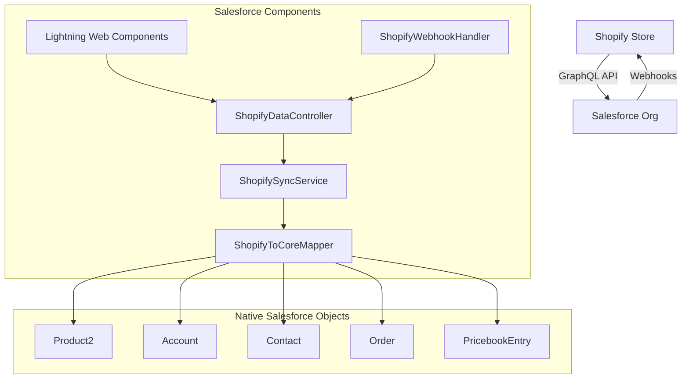
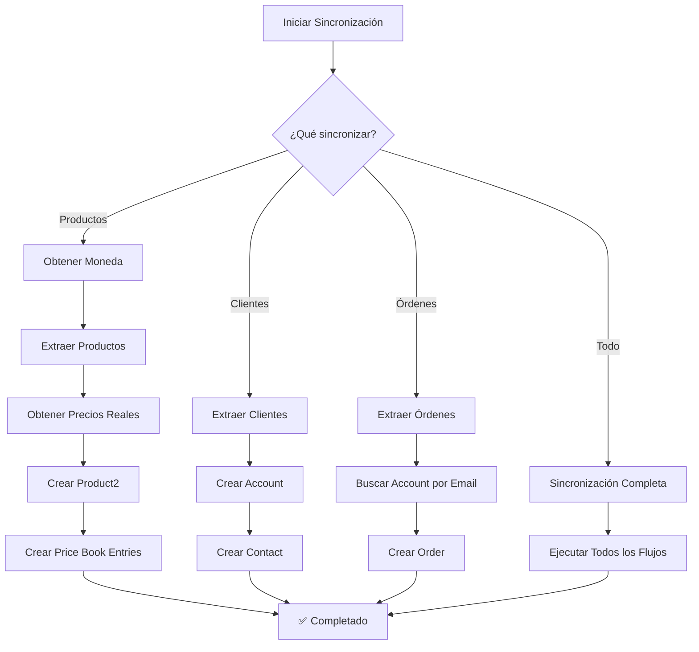

# 🛍️ Integración Shopify - Salesforce

Una integración completa y robusta entre Shopify y Salesforce que permite sincronizar productos, clientes y órdenes de manera bidireccional usando objetos nativos de Salesforce.

## 📋 Tabla de Contenidos

- [🎯 Características Principales](#-características-principales)
- [🏗️ Arquitectura del Sistema](#️-arquitectura-del-sistema)
- [📦 Componentes del Proyecto](#-componentes-del-proyecto)
- [⚙️ Configuración e Instalación](#️-configuración-e-instalación)
- [🚀 Uso del Sistema](#-uso-del-sistema)
- [🔧 API y Métodos](#-api-y-métodos)
- [📊 Objetos y Campos Personalizados](#-objetos-y-campos-personalizados)
- [🔄 Flujo de Sincronización](#-flujo-de-sincronización)
- [🛠️ Desarrollo y Testing](#️-desarrollo-y-testing)
- [📈 Monitoreo y Logs](#-monitoreo-y-logs)
- [🔒 Seguridad](#-seguridad)
- [❓ Troubleshooting](#-troubleshooting)
- [📝 Changelog](#-changelog)

## 🎯 Características Principales

### ✨ Funcionalidades Core
- **🔄 Sincronización Bidireccional**: Productos, clientes y órdenes entre Shopify y Salesforce
- **💰 Precios Reales**: Extracción automática de precios reales de Shopify con Price Book Entries
- **🏢 Objetos Nativos**: Uso de objetos estándar de Salesforce (Product2, Account, Contact, Order)
- **📱 Interfaz Moderna**: Lightning Web Components con diseño responsivo
- **🔧 Configuración Flexible**: Credenciales y configuraciones centralizadas
- **📊 Dashboard Completo**: Panel de control para gestión de sincronización
- **🧹 Limpieza de Datos**: Herramientas para limpiar datos de prueba

### 🚀 Ventajas Técnicas
- **GraphQL API**: Uso de la API moderna de Shopify para mejor rendimiento
- **Manejo de Errores**: Sistema robusto de manejo de errores y logging
- **Transacciones Seguras**: Gestión adecuada de transacciones DML
- **Escalabilidad**: Diseño preparado para grandes volúmenes de datos
- **Mantenibilidad**: Código bien documentado y modular

## 🏗️ Arquitectura del Sistema



## 📦 Componentes del Proyecto

### 🔧 Apex Classes

#### `ShopifyDataController.cls`
**Controlador principal** que maneja toda la lógica de negocio y comunicación con Shopify.

**Métodos Principales:**
- `syncProductsOnly()` - Sincronización de productos con precios reales
- `syncCustomersOnly()` - Sincronización de clientes a Account + Contact
- `syncOrdersOnly()` - Sincronización de órdenes
- `syncHistoricalDataFromShopify()` - Sincronización completa
- `limpiarBaseDeDatos()` - Limpieza de datos existentes
- `getShopifyProducts()` - Consulta de productos (LWC)
- `getShopifyCustomers()` - Consulta de clientes (LWC)
- `getShopifyOrders()` - Consulta de órdenes (LWC)

#### `ShopifySyncService.cls`
**Servicio de sincronización** que maneja la lógica de mapeo y sincronización de datos.

**Funcionalidades:**
- Sincronización de clientes a Account + Contact
- Sincronización de productos con Price Book Entries
- Sincronización de órdenes
- Limpieza de datos de Shopify
- Gestión de relaciones entre objetos

#### `ShopifyToCoreMapper.cls`
**Mapeador de datos** que convierte datos de Shopify a objetos nativos de Salesforce.

**Métodos de Mapeo:**
- `mapCustomerToAccount()` - Cliente → Account
- `mapCustomerToContact()` - Cliente → Contact
- `mapProductToProduct2()` - Producto → Product2
- `createPricebookEntry()` - Crear Price Book Entry
- `mapOrderToOrder()` - Orden → Order
- `extractFirstVariantPrice()` - Extraer precio de variante

#### `ShopifyWebhookHandler.cls`
**Manejador de webhooks** para recibir notificaciones de Shopify en tiempo real.

### 🎨 LWC - Lightning Web Components

#### `shopifyDashboard`
**Panel de control principal** para gestión de la integración.

**Características:**
- Estado de conexión en tiempo real
- Botones de sincronización individual y completa
- Herramientas de limpieza de datos
- Información de configuración

#### `shopifyProducts`
**Gestión de productos** sincronizados desde Shopify.

**Funcionalidades:**
- Lista de productos con precios reales
- Filtros por estado y categoría
- Formateo de moneda (COP)
- Acciones de vista y edición

#### `shopifyCustomers`
**Gestión de clientes** sincronizados desde Shopify.

**Funcionalidades:**
- Lista de clientes con información completa
- Filtros por nombre y email
- Gestión de cuentas y contactos
- Acciones de vista y edición

#### `shopifyOrders`
**Gestión de órdenes** sincronizadas desde Shopify.

**Funcionalidades:**
- Lista de órdenes con estados
- Filtros por estado y cliente
- Formateo de fechas y montos
- Acciones de vista y edición

### 🔗 Configuraciones

#### Named Credentials
- **Shopify_API**: Credenciales para autenticación con Shopify

#### Remote Site Settings
- **Shopify_Integration**: Configuración de sitio remoto para Shopify
- **Shopify_Remote_Site**: Configuración adicional de sitio remoto

#### Custom Fields
- **Product2.ShopifyProductId__c**: ID único del producto en Shopify
- **Account.ShopifyCustomerId__c**: ID único del cliente en Shopify
- **Contact.ShopifyCustomerId__c**: ID único del cliente en Shopify
- **Order.ShopifyOrderId__c**: ID único de la orden en Shopify
- **Order.ShopifyOrderNumber__c**: Número de orden de Shopify
- **Order.ShopifyTotalAmount__c**: Monto total de la orden
- **Order.ShopifyFinancialStatus__c**: Estado financiero de la orden

## ⚙️ Configuración e Instalación

### 📋 Prerrequisitos

- **Salesforce Org**: Developer Edition o superior
- **Shopify Store**: Tienda activa con acceso a Admin API
- **SFDX CLI**: Herramientas de desarrollo de Salesforce
- **Node.js**: Para herramientas de desarrollo (opcional)

### 🚀 Instalación

1. **Clonar el repositorio:**
```bash
git clone <repository-url>
cd shopify-salesforce-integration
```

2. **Configurar Salesforce CLI:**
```bash
sf org login web --alias shopifyOrg
```

3. **Desplegar el proyecto:**
```bash
sf project deploy start --target-org shopifyOrg
```

4. **Configurar credenciales de Shopify:**
   - Editar `ShopifyDataController.cls`
   - Actualizar `shopDomain` y `apiKey`
   - Actualizar `webhookSecret`

5. **Configurar Remote Site Settings:**
   - Verificar que las URLs de Shopify estén permitidas
   - Configurar Named Credentials si es necesario

### 🔧 Configuración de Shopify

1. **Crear Private App en Shopify:**
   - Ir a Settings → Apps and sales channels
   - Crear Private App
   - Configurar permisos de Admin API
   - Obtener Access Token

2. **Configurar Webhooks (Opcional):**
   - Configurar webhooks para eventos de productos, clientes y órdenes
   - URL del webhook: `https://tu-org.salesforce.com/services/apexrest/shopify/webhook`

## 🚀 Uso del Sistema

### 📊 Dashboard Principal

1. **Acceder al Dashboard:**
   - Navegar a la página donde está desplegado el componente `shopifyDashboard`
   - Verificar estado de conexión

2. **Sincronización de Datos:**
   - **Limpiar Base de Datos**: Eliminar datos existentes antes de sincronizar
   - **Sincronizar Productos**: Sincronizar productos con precios reales
   - **Sincronizar Clientes**: Sincronizar clientes a Account + Contact
   - **Sincronizar Órdenes**: Sincronizar órdenes
   - **Sincronizar Todo**: Sincronización completa de todos los datos

### 🔄 Flujo de Sincronización

#### Sincronización de Productos
1. **Obtener moneda** de la tienda Shopify
2. **Extraer productos** usando GraphQL API
3. **Obtener precios reales** de las variantes
4. **Crear/Actualizar Product2** en Salesforce
5. **Crear Price Book Entries** con precios reales

#### Sincronización de Clientes
1. **Extraer clientes** usando GraphQL API
2. **Crear/Actualizar Account** para cada cliente
3. **Crear/Actualizar Contact** asociado al Account
4. **Mantener relaciones** entre Account y Contact

#### Sincronización de Órdenes
1. **Extraer órdenes** usando GraphQL API
2. **Buscar Account** por email del cliente
3. **Crear/Actualizar Order** en Salesforce
4. **Asociar Order** con Account correspondiente

## 🔧 API y Métodos

### 📡 GraphQL Queries

#### Productos
```graphql
{
  products(first: 10) {
    edges {
      node {
        id
        title
        handle
        productType
        status
        description
        tags
        variants(first: 1) {
          edges {
            node {
              price
            }
          }
        }
      }
    }
  }
}
```

#### Clientes
```graphql
{
  customers(first: 50) {
    edges {
      node {
        id
        firstName
        lastName
        email
        phone
      }
    }
  }
}
```

#### Órdenes
```graphql
{
  orders(first: 50) {
    edges {
      node {
        id
        orderNumber
        totalPriceSet {
          shopMoney {
            amount
          }
        }
        financialStatus
        email
        createdAt
      }
    }
  }
}
```

### 🔌 Apex API Methods

#### Métodos Públicos (@AuraEnabled)
- `syncProductsOnly()` - Sincronizar solo productos
- `syncCustomersOnly()` - Sincronizar solo clientes
- `syncOrdersOnly()` - Sincronizar solo órdenes
- `syncHistoricalDataFromShopify()` - Sincronización completa
- `limpiarBaseDeDatos()` - Limpiar datos existentes
- `getShopifyProducts()` - Obtener productos (LWC)
- `getShopifyCustomers()` - Obtener clientes (LWC)
- `getShopifyOrders()` - Obtener órdenes (LWC)

#### Métodos Privados
- `getShopCurrency()` - Obtener moneda de la tienda
- `getProductsSimple()` - Obtener productos con query simple
- `getRealPricesFromShopify()` - Obtener precios reales
- `createPriceBookEntriesWithPrices()` - Crear Price Book Entries

## 📊 Objetos y Campos Personalizados

### 🏷️ Campos Personalizados

#### Product2
- **ShopifyProductId__c** (Text, External ID, Unique)
  - ID único del producto en Shopify
  - Usado para sincronización y deduplicación

#### Account
- **ShopifyCustomerId__c** (Text, External ID, Unique)
  - ID único del cliente en Shopify
  - Usado para sincronización y deduplicación

#### Contact
- **ShopifyCustomerId__c** (Text, External ID, Unique)
  - ID único del cliente en Shopify
  - Usado para sincronización y deduplicación

#### Order
- **ShopifyOrderId__c** (Text, External ID, Unique)
  - ID único de la orden en Shopify
- **ShopifyOrderNumber__c** (Text)
  - Número de orden de Shopify
- **ShopifyTotalAmount__c** (Currency)
  - Monto total de la orden
- **ShopifyFinancialStatus__c** (Text)
  - Estado financiero de la orden

### 🔗 Relaciones

- **Account ↔ Contact**: Relación estándar de Salesforce
- **Account ↔ Order**: Relación estándar de Salesforce
- **Product2 ↔ PricebookEntry**: Relación estándar de Salesforce

## 🔄 Flujo de Sincronización

### 📈 Diagrama de Flujo



### ⚡ Optimizaciones

1. **Callouts Antes de DML**: Los callouts se ejecutan antes de las operaciones DML para evitar errores de transacción
2. **Upsert por External ID**: Uso de campos External ID para deduplicación automática
3. **Batch Processing**: Procesamiento en lotes para mejor rendimiento
4. **Error Handling**: Manejo robusto de errores con logging detallado

## 🛠️ Desarrollo y Testing

### 🧪 Testing

#### Pruebas Unitarias
```bash
sf apex run test --class-names ShopifyDataControllerTest --target-org shopifyOrg
```

#### Pruebas de Integración
1. **Probar Conexión**: Verificar conectividad con Shopify
2. **Probar Sincronización**: Ejecutar sincronización de prueba
3. **Verificar Datos**: Confirmar que los datos se crean correctamente

### 🔧 Desarrollo

#### Estructura de Archivos
```
force-app/main/default/
├── classes/                    # Apex Classes
│   ├── ShopifyDataController.cls
│   ├── ShopifySyncService.cls
│   ├── ShopifyToCoreMapper.cls
│   └── ShopifyWebhookHandler.cls
├── lwc/                       # Lightning Web Components
│   ├── shopifyDashboard/
│   ├── shopifyProducts/
│   ├── shopifyCustomers/
│   └── shopifyOrders/
├── objects/                   # Custom Objects & Fields
│   ├── Product2/fields/
│   ├── Account/fields/
│   ├── Contact/fields/
│   └── Order/fields/
├── namedCredentials/          # API Credentials
└── remoteSiteSettings/        # Remote Site Settings
```

#### Comandos de Desarrollo
```bash
# Desplegar cambios
sf project deploy start --target-org shopifyOrg

# Desplegar componente específico
sf project deploy start --source-dir force-app/main/default/lwc/shopifyDashboard --target-org shopifyOrg

# Ejecutar tests
sf apex run test --target-org shopifyOrg

# Ver logs
sf apex log tail --target-org shopifyOrg
```

## 📈 Monitoreo y Logs

### 🔍 Debug Logs

El sistema incluye logging extensivo para monitoreo y debugging:

#### Niveles de Log
- **🔄 INICIANDO**: Inicio de operaciones
- **📊 PROCESANDO**: Procesamiento de datos
- **✅ EXITOSO**: Operaciones completadas
- **❌ ERROR**: Errores y excepciones
- **💰 PRECIOS**: Información de precios
- **📦 PRODUCTOS**: Información de productos

#### Ver Logs
```bash
# Ver logs en tiempo real
sf apex log tail --target-org shopifyOrg --debug-level DEBUG

# Ver logs específicos
sf apex log get --log-id <log-id> --target-org shopifyOrg
```

### 📊 Métricas de Rendimiento

- **Tiempo de Sincronización**: Tiempo total de sincronización
- **Registros Procesados**: Número de registros sincronizados
- **Errores**: Número y tipo de errores
- **Precios Extraídos**: Número de precios reales obtenidos

## 🔒 Seguridad

### 🛡️ Medidas de Seguridad

1. **Credenciales Seguras**: Uso de Named Credentials para autenticación
2. **Validación de Datos**: Validación de entrada en todos los métodos
3. **Manejo de Errores**: No exposición de información sensible en errores
4. **Permisos de Usuario**: Control de acceso basado en permisos de Salesforce
5. **HTTPS**: Todas las comunicaciones usan HTTPS

### 🔐 Configuración de Seguridad

1. **Remote Site Settings**: Configurar URLs permitidas
2. **Named Credentials**: Configurar autenticación segura
3. **Permisos de Usuario**: Asignar permisos apropiados
4. **Validación de Webhooks**: Validar firmas de webhooks

## ❓ Troubleshooting

### 🚨 Problemas Comunes

#### Error: "You have uncommitted work pending"
**Causa**: Intentar hacer callout después de operaciones DML
**Solución**: Los callouts se ejecutan antes de las operaciones DML

#### Error: "Script-thrown exception"
**Causa**: Error en parsing de respuesta GraphQL
**Solución**: Verificar sintaxis de queries GraphQL

#### Error: "500 Server Error"
**Causa**: Query GraphQL inválida o problema de conectividad
**Solución**: Verificar conectividad y sintaxis de queries

#### Precios en $0.00
**Causa**: No se extraen precios reales de Shopify
**Solución**: Verificar query de variantes y parsing de precios

### 🔧 Soluciones

1. **Verificar Conectividad**: Comprobar Remote Site Settings
2. **Revisar Logs**: Usar Debug Logs para identificar problemas
3. **Validar Credenciales**: Verificar API Key de Shopify
4. **Probar Queries**: Usar herramientas de GraphQL para probar queries

### 📞 Soporte

Para soporte técnico:
1. Revisar logs de debug
2. Verificar configuración
3. Consultar documentación de Shopify API
4. Contactar al equipo de desarrollo

## 📝 Changelog

### Version 1.0.0 (2025-01-27)

#### ✨ Nuevas Características
- Integración completa Shopify-Salesforce
- Sincronización de productos con precios reales
- Sincronización de clientes a Account + Contact
- Sincronización de órdenes
- Dashboard de gestión completo
- Lightning Web Components responsivos
- Sistema de logging extensivo

#### 🔧 Mejoras Técnicas
- Uso de GraphQL API de Shopify
- Objetos nativos de Salesforce
- Manejo robusto de errores
- Transacciones seguras
- Código modular y mantenible

#### 🐛 Correcciones
- Error de "uncommitted work pending"
- Parsing de precios de variantes
- Sincronización de precios reales
- Refresco automático de interfaz

---

**¡Gracias por usar la Integración Shopify-Salesforce! 🚀**
